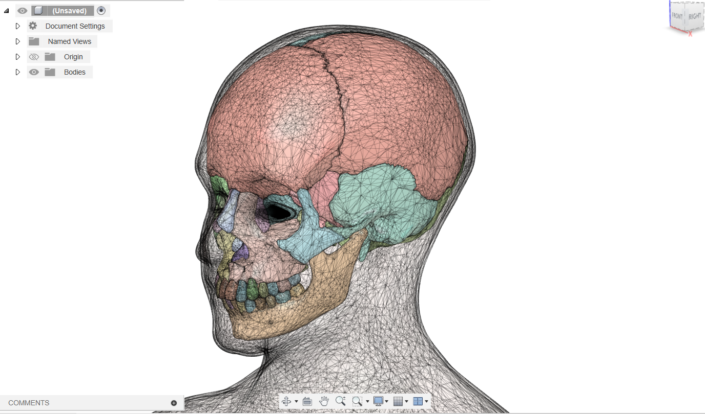

# **Raw Data for Creating a Custom Dummy Head**

This repository provides the raw 3D data (51 unprocessed OBJ files) derived from the **BodyParts3D Project**. These files are intended for those who wish to create a similar dummy head with their own customizations.

If you'd like to see how these files can be modified and used to create a dummy head, check out our modified version and the associated demonstration video:

- **Modified Model Repository:** [Zenodo Repository](https://doi.org/10.5281/zenodo.13777788)  
- **Video Demo:** [YouTube Video](https://youtu.be/5bxazr6eseA)

The files provided here are the unprocessed versions of the data, filtered and organized to make customization easier.

  

---

## **Contents**

The ZIP file in this repository contains 51 OBJ files, organized into the following folders:
1. **Full-Body Skin:** OBJ files for the skin model.
2. **Skull:** OBJ files for the skull model.
3. **Tooth:** OBJ files for the teeth.

These files are a subset of the original BodyParts3D dataset, provided as-is, with no modifications or processing.

---

## **Source**

The original data comes from the **BodyParts3D Project**, a human anatomy dataset created by the **National Institute of Information and Communications Technology (NICT)**. The dataset is available under the **CC-BY-SA 2.1 Japan license**.

For more information about the BodyParts3D Project, visit:  
- [https://lifesciencedb.jp/bp3d/](https://lifesciencedb.jp/bp3d/)

---

## **How to Cite**

If you use these raw files, please cite the BodyParts3D Project. For processed files and dummy head models, refer to our Zenodo repository:  
- [Zenodo Repository](https://doi.org/10.5281/zenodo.13777788)
